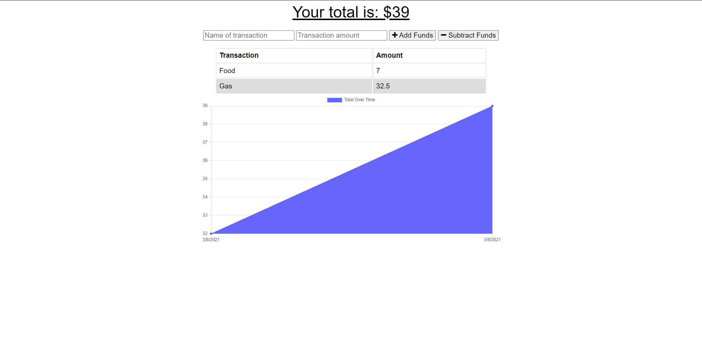

# Budget Tracker PWA

## Description

An app that allows users to add expenses and deposits to their budget with or without a connection

**Link to Deployed Application:** [https://thawing-shelf-72208.herokuapp.com/](https://thawing-shelf-72208.herokuapp.com/)

## Table of Contents

- [Installation](#installation)
- [Screenshots](#screenshots)
- [Contributing](#contributing)
- [Questions](#questions)
- [License](#license)

## Installation

No installation needed.

## Screenshots

## Contributing

When contributing to this repository, please first discuss the change you wish to make via issue, email, or any other method with the owners of this repository before making a change.

## Questions

If you have any additional questions, please feel free to contact me at:  
E-mail: burgos.aldrin@gmail.com  
Github: [aldrinburgos18](https://github.com/aldrinburgos18)

## License

  
A short and simple permissive license with conditions only requiring preservation of copyright and license notices. Licensed works, modifications, and larger works may be distributed under different terms and without source code.  
_[More Information about this license...](https://opensource.org/licenses/MIT)_
